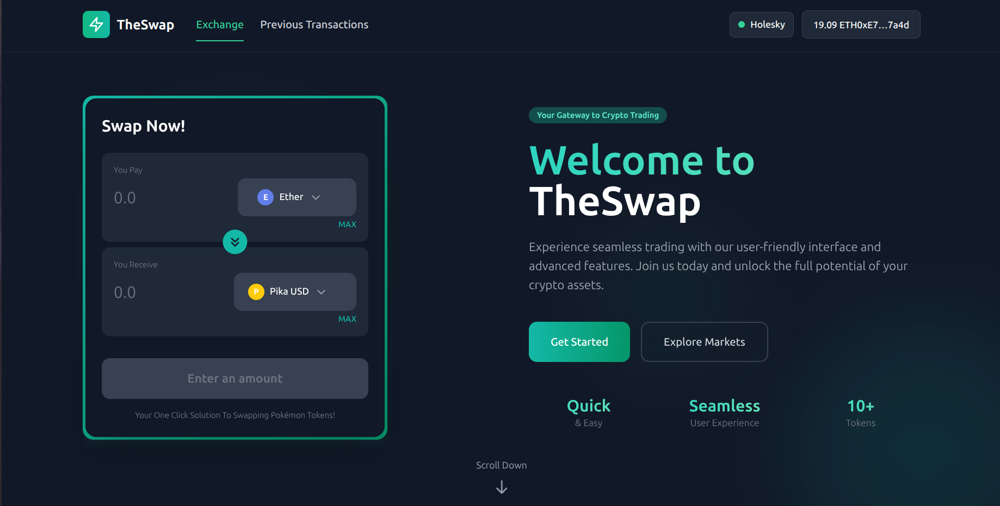

# TheSwap: Pokémon-Themed Token Exchange

**TheSwap** is a fully functioning decentralized exchange (DEX) I built from scratch to demonstrate full-stack Web3 development expertise. This project enables users to mint and swap Pokémon-themed ERC20 tokens through an intuitive interface with real blockchain integration.



## 🔧 Technical Implementation

### 🛠️ Core Development Skills
- **Smart Contracts**: Developed 8 custom ERC20 tokens (Pika USD, Bulba Coin, etc.) using Solidity
- **DEX Engine**: Built swapping functionality with `CustomDex.sol` (Hardhat)
- **Web3 Integration**: Wallet connection via ethers.js/wagmi (supports MetaMask, Coinbase Wallet, WalletConnect)
- **Frontend**: Next.js with TailwindCSS for responsive design
- **Blockchain**: Live transactions on Holesky testnet

### 🚀 Key Features

✅ **Token System**
- Minted initial supply on contract deployment
- 8 Pokémon-themed tokens with custom branding

✅ **Exchange Functionality**
- ETH ↔ Token swaps
- Token ↔ Token exchanges
- Real-time price calculations

✅ **User Experience**
- Wallet balance tracking
- Transaction history log
- Mobile-responsive interface
- Real-time balance updates

## Pokémon Token Collection

TheSwap features these custom Pokémon-themed tokens:

- **Pika USD**: Pikachu-themed stablecoin
- **Bulba Coin**: Grass-type token
- **USD Chard**: Fire-type token
- **squirtleETH**: Water-type token
- **Pidgey Token**: Flying-type token
- **MewtwoETH**: Psychic-type token
- **Gengar INR**: Ghost-type token
- **Eevee Token**: Normal-type token

## Project Tech Stack

- **Frontend**: Next.js, React, TailwindCSS
- **Smart Contracts**: Solidity, Hardhat
- **Web3 Integration**: ethers.js, wagmi
- **Network**: Holesky Testnet

## Live Demo

Deployed site - TheSwap: [TheSwap](https://theswap-two.vercel.app/)

## Installation

Follow these steps to run TheSwap project locally:

### Prerequisites

- Node.js (v18.12.1 or higher)
- npm (8.19.2 or higher)
- MetaMask or any Web3 wallet
- Holesky testnet ETH (for testing transactions)

### Setup Instructions

1. Clone the repository:

```bash
git clone https://github.com/Aaryan-549/TheSwap.git
cd TheSwap
```

2. Install dependencies:

```bash
npm install
```

3. Create a `.env.local` file in the root directory with the following variables:

```
NEXT_PUBLIC_MARKETPLACE_ADDRESS=0xYourDeployedContractAddress
NEXT_PUBLIC_HOLESKY_RPC_URL=https://rpc.ankr.com/eth_holesky
```

4. Start the development server:

```bash
npm run dev
```

5. Open your browser and navigate to http://localhost:3000

## Smart Contracts

The project includes the following main smart contracts:

- **CustomToken.sol**: ERC20 token implementation for Pokémon tokens
- **CustomDex.sol**: DEX contract handling token swaps and liquidity

### Contract Addresses (Holesky Testnet)

- DEX Contract: [`0xYourDexContractAddress`](https://holesky.etherscan.io/address/0xYourDexContractAddress)
- Pika USD: [`0xPikaUSDAddress`](https://holesky.etherscan.io/address/0xPikaUSDAddress)
- Bulba Coin: [`0xBulbaCoinAddress`](https://holesky.etherscan.io/address/0xBulbaCoinAddress)
- And more...

## Getting Testnet Tokens

To test the application, you'll need Holesky testnet ETH:

1. Get testnet ETH from [Holesky Faucet](https://faucet.holesky.ethpandaops.io/)
2. Connect your wallet to TheSwap
3. Use the swap feature to exchange ETH for Pokémon tokens

## Development

### Deploy Your Own Version

1. Deploy the smart contracts to Holesky testnet:

```bash
npx hardhat run scripts/deploy.js --network holesky
```

2. Update the contract addresses in your `.env.local` file

### Project Structure

```
├── components/          # React components
├── contracts/           # Solidity smart contracts
├── pages/               # Next.js pages
├── public/              # Static assets
├── scripts/             # Deployment scripts
├── styles/              # CSS styles
├── utils/               # Utility functions
└── test/                # Contract tests
```

## Contributing

Contributions are welcome! Please feel free to submit a Pull Request.

1. Fork the repository
2. Create your feature branch (`git checkout -b feature/amazing-feature`)
3. Commit your changes (`git commit -m 'Add some amazing feature'`)
4. Push to the branch (`git push origin feature/amazing-feature`)
5. Open a Pull Request

## License

This project is licensed under the MIT License - see the LICENSE file for details.

## Contact

Aaryan Beniwal - [abeniwal_be23@thapar.edu](mailto:abeniwal_be23@thapar.edu)

Project Link: [https://github.com/Aaryan-549/TheSwap](https://github.com/Aaryan-549/TheSwap)

## Acknowledgments

- Inspired by Pokémon and the world of decentralized finance
- Built for educational purposes to demonstrate Web3 development skills
- Special thanks to the Ethereum and Next.js communities for their excellent documentation